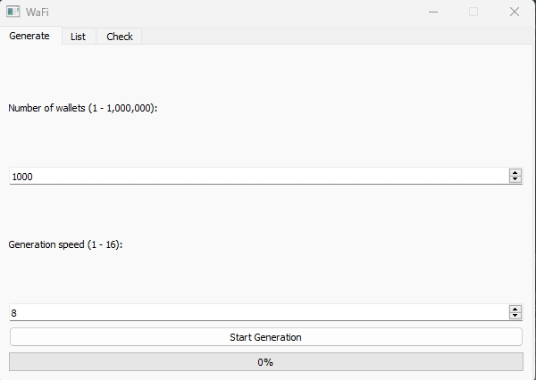
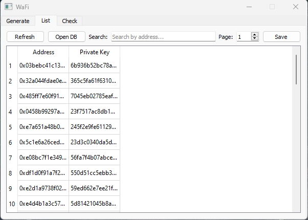
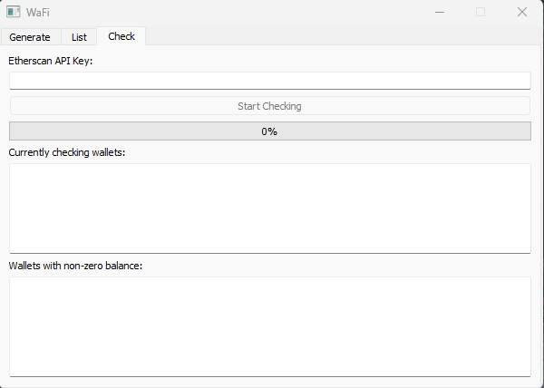

# WaFi — Ethereum Wallet Tool

**WaFi** is a Windows application designed for Ethereum wallet management, including bulk wallet generation, wallet database viewing/editing, and balance checking via Etherscan API.

---

## Features

### 1. **Generate Wallets**
- Generate from 1 to 1,000,000 Ethereum wallets
- Adjustable generation speed (1–16)
- Automatically creates a `wallets.db` SQLite database
- Stores both wallet addresses and private keys
- Saves database in `C:\Users\%User%\WaFi\wallets.db`

### 2. **List Wallets**
- View all wallets stored in the database
- Pagination (50 wallets per page)
- Search by address or key
- Edit address/private key directly in the table
- Save changes to database
- Open default or custom `.db` file

### 3. **Check Balances**
- Validate wallets using the Etherscan API
- Enter and save API key for future sessions
- Shows wallets with non-zero balances
- Shows currently checked wallets (live scrolling)
- Displays a background progress indicator
- Separates wallets with and without balances into different files

---

## 🔐 License Activation

WaFi includes a 7-day free trial. After that, you can activate full access using a license key.

### How it works:
1. Click **Buy License** in the Telegram bot @wafi_license_key_bot
2. Pay securely through the provided link.
3. You’ll receive your license key instantly in the chat.
4. Enter the key in WaFi to activate — the license lasts for 30 days.

If the license is valid, it will be remembered — no need to re-enter it every session.

### Payment Flow Preview

| Telegram Bot Prompt | Payment Page | License Entry in WaFi |
|---------------------|--------------|------------------------|
|  |  |  |

---

## Auto-Update (Coming Soon)
WaFi can automatically check for new versions and download the latest installer.

---

## Screenshots
Coming soon...

---

## Installation

Download the latest installer from [Releases](https://github.com/Tony-Montanat/wafi/releases) and run it. A desktop shortcut will be created automatically.

---

## Requirements

- Windows 10/11 (64-bit)
- Internet connection for balance checking
- Etherscan API key (free at https://etherscan.io/apis)

---

## License

WaFi is a closed-source utility for personal and development use.
